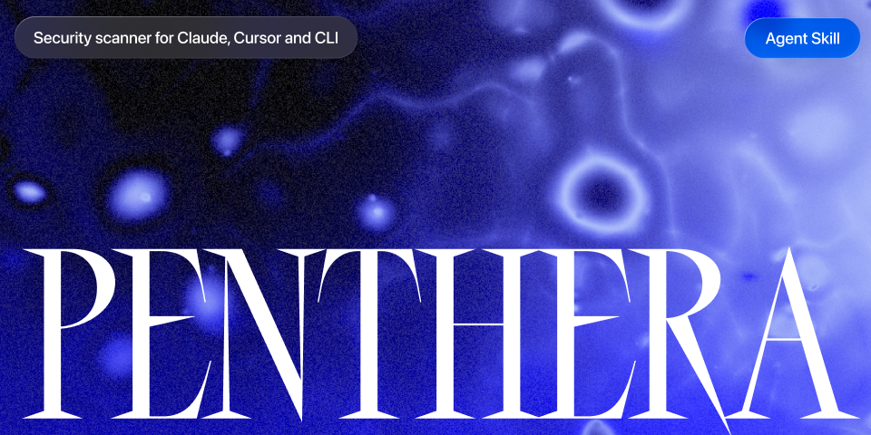
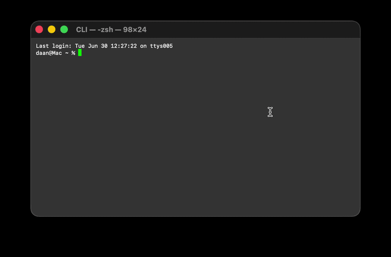
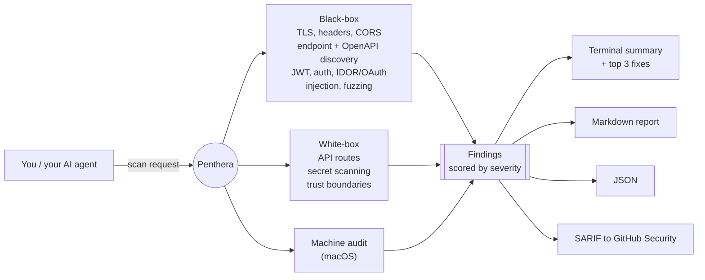

<div align="center">



<br/><br/>


<br/>



</div>

---

## Two ways to use it

**As an Agent Skill (recommended).** Most people start here. Let Cursor or Claude
Code drive it: [install once](#run-it), then ask it to "scan my app for security
issues." The agent picks the scan, runs it, and gives you the fixes.

**As a CLI.** Prefer the terminal? Run `penthera https://myapp.com`, or just
`penthera` for the guided wizard. See the [quick start](#quick-start).

---

## Why Penthera

You shipped something fast: vibecoded, AI-assisted, already live. The same models
that helped you build it also make it easy for someone to probe it. Exposed API
routes, missing security headers, weak auth, a hardcoded key in the repo. These
are the common mistakes that get apps broken into.

Penthera is the check you run before you launch. Ask your agent to "scan my app
for security issues" and it runs an authorized, non-destructive scan, then lists
the top fixes in priority order. You do not need a DAST suite or a security
background to use it.

Penthera is for hardening systems you own. It is powerful, so please use it
carefully. See [Ethical use](#ethical-use--authorization) and the [Disclaimer](#disclaimer).

---

## Run it

**One-line install** (clones the repo, links the CLI, and installs the skill into
Cursor and Claude Code if it finds them):

```bash
curl -fsSL https://raw.githubusercontent.com/danoszz/penthera/main/install.sh | bash
```

**Or via the Agent Skills CLI** (Cursor, Claude Code, and [40+ agents](https://agentskills.io/clients)):

```bash
npx skills add danoszz/penthera
```

Then talk to your agent:

```
"Scan my localhost:3000 for security issues"
"Run a pre-deploy security audit on staging.myapp.com"
"Find hardcoded secrets in this repo before I push"
```

Prefer the terminal? Run `penthera` with no arguments for a guided wizard.

> The skill enforces an authorization gate: agents refuse to scan a target you
> do not own or are not authorized to test.

---

## What it does

| Mode | Command | Coverage |
|------|---------|----------|
| **URL scan** | `penthera https://example.com` | TLS, fingerprinting, endpoint discovery, templates, CORS, cookies, JS CVEs, param discovery, OpenAPI/FastAPI probes, security headers, auth hardening |
| **Repo scan** | `penthera --repo ./my-app` | API route discovery (Next.js, Express, Hono, Fastify), trust-boundary mapping, hardcoded-secret scanning |
| **Combined** | `penthera https://staging.app --repo .` | Black-box and white-box in one run |
| **Interactive** | `penthera` *(no args)* | Guided wizard (URL plus optional repo scan, Markdown report) |
| **Machine audit** | `penthera --machine` | macOS checks (keyloggers, persistence, rootkits) |

Pick a profile, or add individual flags for more depth:

| Profile | Command | What runs |
|---------|---------|-----------|
| **quick** | `--profile quick` | Headers, OpenAPI, auth smoke tests (about 10s) |
| **standard** | *(default)* | Full non-destructive scan |
| **deep** | `--profile deep` | recon, injection probes, and API fuzzing |

Individual flags: `--recon`, `--deep`, `--fuzz`, `--adaptive`, `--nuclei <path>`, `--templates <dirs>`, `--all`

---

## How it works



Findings map to the [OWASP Web Security Testing Guide](docs/owasp-wstg-coverage.md)
(WSTG v4.2). The default scan is non-destructive. Payload-based testing is opt-in
(`--deep`, `--fuzz`, `--all`) and gated behind explicit confirmation.

---

## Ethical use & authorization

Penthera sends HTTP requests to the targets you give it. Some modes (`--deep`,
`--fuzz`, `--all`) send attack payloads designed to find vulnerabilities. Use it
responsibly.

**You may use Penthera when:**

- You **own** the target (your app, your server, your project).
- You have **written authorization** from the system owner (email, ticket, signed scope).
- You scan **localhost** or private lab environments you control.
- You use it for **defensive security**: research, coursework, CI hardening, pre-release audits.

**You must not use Penthera to:**

- Scan systems you do not own or lack explicit permission to test.
- Probe government, healthcare, financial, or third-party production systems without authorization.
- Exfiltrate data, disrupt services, or bypass access controls.
- Use findings to attack, extort, or harm anyone.

> Before scanning any URL that is not localhost, confirm you have permission.
> **When in doubt, do not scan.**

Unauthorized security testing may violate computer-misuse laws (for example the US
CFAA, the UK Computer Misuse Act, and EU national equivalents) and can result in
criminal prosecution, civil liability, IP blocking, account termination, and
academic or professional penalties.

---

## Disclaimer

Penthera is provided for legitimate security research and defensive testing of
systems you own or are authorized to test, and for that purpose only.

- It is a research and self-assessment tool. Scan your own apps to find and fix
  weaknesses before attackers do.
- The same capabilities that harden a system can cause harm if pointed at someone
  else's. Use it carefully and lawfully.
- The author does not condone unauthorized or malicious use, and accepts no
  liability for any damage, loss, or legal consequence arising from use or misuse
  of this software.
- The software is provided "as is", without warranty of any kind. See [LICENSE](LICENSE) (MIT).
- You are solely responsible for ensuring every scan you run is authorized and
  legal in your jurisdiction.

By using Penthera you accept these terms.

---

## Install

The [one-line installer](#run-it) is the fastest path. To set it up manually:

```bash
git clone https://github.com/danoszz/penthera.git
cd penthera
npm install
npm link            # exposes `penthera` and `penthera-scan` globally
penthera --version
```

Requirements: Node.js 18+ and npm. Optional: nuclei-templates for `--nuclei`, and
Docker. To run it in a container:

```bash
docker build -t penthera .
docker run --rm penthera https://your-app.example
```

---

## Quick start

```bash
# First time? Run with no args for guided setup
penthera

# Safe default scan (non-destructive)
penthera https://myapp.com

# Staging plus source code, full report set
penthera https://staging.myapp.com --repo . --all -o reports/scan.json --sarif reports/scan.sarif

# Baseline diff: show only new findings since the last scan
penthera https://myapp.com -o reports/scan.json --baseline reports/previous.json

# Authenticated scan (session cookie or bearer token)
PENTHERA_BEARER=eyJ... penthera https://myapp.com --profile standard
penthera https://myapp.com --auth-cookie "session=abc123"
```

Writing to `-o reports/scan.json` also drops a human-readable `reports/scan.md`
next to it. Reports are gitignored by default.

### Exit codes

| Code | Meaning |
|------|---------|
| `0` | No critical or high findings |
| `1` | Critical or high findings detected |
| `2` | Scan failed (unreachable target, bad config) |

---

## Output

| Format | Flag | Use |
|--------|------|-----|
| Terminal | *(default)* | Colored summary plus top 3 fixes |
| **Markdown** | `--markdown file.md` or `-o file.json` | Human-readable report (exec summary, findings tables, fixes). Written next to `-o` automatically |
| JSON | `--json` or `-o file.json` | CI pipelines, baseline diffs, custom tooling |
| SARIF | `--sarif file.sarif` | GitHub Security / Code Scanning tab |

---

## For your AI coding agent

Penthera ships as an [Agent Skill](https://agentskills.io), the open format used
by Cursor, Claude Code, Claude.ai, and [40+ agent tools](https://agentskills.io/clients).
The skill teaches an agent to run authorized scans, pick the right profile, and
summarize findings, so you can just describe what you want.

**Install** (any of these):

```bash
# Cross-agent, frictionless
npx skills add danoszz/penthera

# Or the one-line installer (also links the CLI)
curl -fsSL https://raw.githubusercontent.com/danoszz/penthera/main/install.sh | bash

# Or copy into a single project for team sharing
cp -r skills/penthera .cursor/skills/penthera     # Cursor
cp -r skills/penthera .claude/skills/penthera     # Claude Code
```

For Claude.ai (web), zip and upload the skill:

```bash
npm run package:skill   # produces penthera-skill.zip; upload in Settings > Capabilities > Skills
```

**Prompts that trigger it:**

- "Scan my localhost app on port 3000 for security issues"
- "Run a pre-deploy audit on staging.myapp.com and summarize critical findings"
- "Scan this repo for hardcoded secrets and exposed API routes"
- "Compare today's scan to last week's baseline and show only new findings"
- "Generate a SARIF report for GitHub code scanning"

The skill includes a mandatory authorization gate. It refuses targets you do not
own or are not authorized to test. Run preflight before the first scan:

```bash
bash skills/penthera/scripts/preflight.sh http://localhost:3000
```

Skill source and workflows live in [`skills/penthera/SKILL.md`](skills/penthera/SKILL.md).

---

## CI integration

```yaml
# Scan a staging URL on a schedule and upload results to GitHub Security.
# Set the PENTEST_STAGING_URL secret to enable. Full example: .github/workflows/scan.yml
- run: npx penthera "$PENTEST_URL" --profile standard --sarif reports/scan.sarif
- uses: github/codeql-action/upload-sarif@v3
  with:
    sarif_file: reports/scan.sarif
```

The repo's own CI (`.github/workflows/ci.yml`) runs the offline suites on Node 18,
20, and 22, and self-scans a mock vulnerable API on every push.

---

## Configuration

For live integration tests against your own routes:

```bash
cp pentest.config.example.js pentest.config.js   # gitignored
```

Edit the route groups, then run `npm run pentest:live`. Set `PENTEST_BASE_URL` to
point at staging without editing the file.

---

## Testing & contributing

```bash
npm test                 # full suite (124 tests)
npm run pentest:mock     # offline tests against a local mock vuln API
npm run mock-server      # start the mock API on port 8765
```

See [CONTRIBUTING.md](CONTRIBUTING.md) for the project layout, how to add a probe
or template, the test matrix, and the release and publishing checklist.

---

## Status

**v1.0, production-ready.** URL, repo, and machine scanning, scan profiles,
Markdown, JSON, and SARIF reports, session-aware auth, JWT, IDOR, OAuth, and
header probes, adaptive knowledge-graph probing, a plugins and templates API,
Docker, CI, and the Agent Skill are all shipped. See the [CHANGELOG](CHANGELOG.md)
for the full history.

Penthera is actively maintained. Issues and PRs welcome.

---

## Support Penthera

Penthera is free and MIT-licensed. If it caught something before you shipped it,
you can help keep it maintained:

[](https://github.com/sponsors/danoszz)

Sponsorship funds new probes, broader framework coverage, and keeping the suite
current with new attack patterns. Thank you.

---

## License & disclosure

MIT. See [LICENSE](LICENSE). Report vulnerabilities in Penthera itself via
[SECURITY.md](SECURITY.md). Only scan systems you own or are authorized to test.
